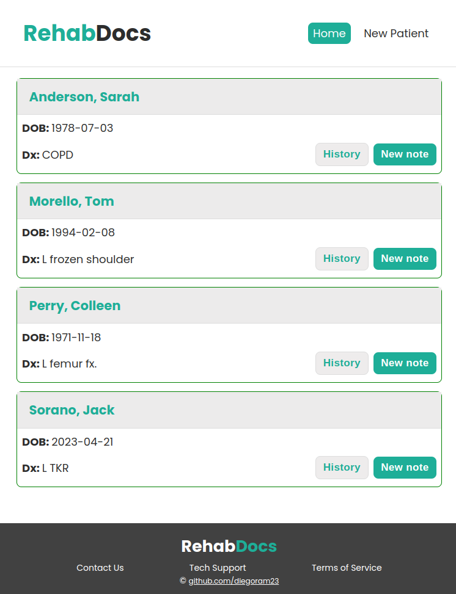

# Rehab Docs

## Mock up of a electronic health records software for physical therapists

NOTE: This project is not intended to be used professionally and is only for educational purposes as it does not provide security to HIPAA. 

NOTE: I have removed deleting permissions and only reading and writing are allowed for demonstration purposes. If you would like to have deleting permissions, you will need to clone this project and set up your own Firebase account and modify permissions there.

This project uses my google firebase account to store and fetch data.

- Create/delete patient caseload
- Write up evals for new patients
- Document daily intervention treatments
- Provide billing for each daily note
- Delete daily notes as needed

## Watch the demo

## How to use or install this project

You can use the link on my github pages to use my project as is or if you would like to make any changes, follow these steps below.

1. clone this project
2. run `npm install` to download the necessary dependencies 
3. run `npm run start` to run it on your local server
4. Set up your own Firebase account if you would like to modify read/write/delete permissions
